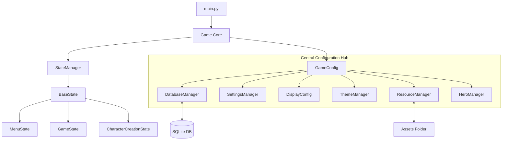

# 🦊 FoxWorld RPG - Documentação Técnica (v0.0.01)

## 1. 🎯 Visão Geral do Projeto

**FoxWorld RPG** é um jogo de RPG 2D por turnos desenvolvido em Python utilizando a biblioteca Pygame. O projeto foca em uma arquitetura robusta, escalável e modular, utilizando padrões de design profissionais para garantir manutenibilidade e expansibilidade.

### Estado Atual: Versão 0.5 (Fim da Fase 1)
O projeto concluiu a **Fase de Fundação**, com todos os sistemas core implementados e funcionais. A infraestrutura está pronta para receber a lógica de gameplay (mapa e batalha).

### Características Principais Implementadas
- ✅ **Sistema de Slots de Jogo**: Gerenciamento completo de 5 slots de save, com criação, carregamento e exclusão de jogos.
- ✅ **Criação de Personagem**: Interface rica para seleção de 5 classes, com atributos e visualização de status.
- ✅ **Arquitetura Centralizada**: Uso de `GameConfig` para injeção de dependências e acesso global a gerenciadores.
- ✅ **UI Responsiva**: Sistema `UIScaler` que adapta toda a interface para qualquer resolução (720p a 4K).
- ✅ **Temas Dinâmicos**: Sistema de temas via JSON (`ThemeManager`) permitindo troca visual completa em tempo real.
- ✅ **Persistência Robusta**: Banco de dados SQLite (`DatabaseManager`) com migrações automáticas e tipagem inteligente.

---

## 2. 🏗️ Arquitetura do Sistema

O projeto segue uma arquitetura baseada em componentes e estados, centralizada no objeto `GameConfig`.

### Fluxo de Dados e Dependências



### Componentes Principais

#### 1. Game (`src/core/game.py`)
O controlador principal. Inicializa o Pygame, o `GameConfig` e o `StateManager`. Gerencia o loop principal (Eventos -> Update -> Render).
**Nota Importante**: O `Game` utiliza as instâncias de gerenciadores já criadas pelo `GameConfig`, evitando duplicação de inicialização.

#### 2. GameConfig (`src/core/game_config.py`)
O "coração" da infraestrutura. Responsável por inicializar todos os gerenciadores na ordem correta de dependência:
1.  `DatabaseManager` (Base de dados)
2.  `SettingsManager` (Configurações salvas no DB)
3.  `DisplayConfig` (Configurações de vídeo)
4.  `ThemeManager` (Temas visuais)
5.  `ResourceManager` (Carregamento de assets, depende do Theme)
6.  `HeroManager` (Lógica de jogo, depende do DB e Resource)

#### 3. StateManager (`src/core/state_manager.py`)
Gerencia a navegação entre telas usando uma pilha de estados.
- `change_state(state)`: Troca completa de contexto (ex: Menu -> Jogo).
- `push_state(state)`: Adiciona uma camada (ex: Jogo -> Inventário).
- `pop_state()`: Remove a camada superior (ex: Fechar Inventário).

#### 4. HeroManager (`src/entities/hero_manager.py`)
Gerencia a lógica de negócio dos heróis.
- CRUD de heróis no banco de dados.
- Conversão entre dados relacionais (DB) e objetos (`Hero`).
- Carregamento de assets visuais do herói via `ResourceManager`.

---

## 3. 📁 Estrutura de Arquivos

```
FoxWorldRPG/
├── assets/                 # Recursos do jogo (Imagens, Sons, Fontes, Temas)
├── config/                 # Configurações do sistema
├── saves/                  # Banco de dados SQLite (game_data.sqlite)
├── src/
│   ├── core/               # Núcleo (Game, StateManager, GameConfig, ResourceManager)
│   ├── database/           # Gerenciamento de Banco de Dados
│   ├── entities/           # Entidades de Jogo (Hero, HeroManager)
│   ├── states/             # Estados do Jogo (Menu, Game, CharacterCreation, etc.)
│   ├── ui/                 # Componentes de UI (Button, Menu, UIScaler)
│   └── utils/              # Utilitários
└── main.py                 # Ponto de entrada
```

---

## 4. ⚡ Sistemas Detalhados

### 4.1. Sistema de Slots e Saves
O jogo utiliza uma tabela `game_slots` para gerenciar até 5 perfis de jogo distintos.
- **Novo Jogo**: Verifica slot vazio -> Criação de Personagem -> Salva no Slot.
- **Carregar**: Lê dados do slot -> Recupera Herói pelo nome -> Inicializa `GameState`.
- **Deletar**: Remove registro do slot e dados do jogador, limpando o espaço.

### 4.2. Interface Responsiva (`UIScaler`)
Todo elemento de UI é renderizado através do `UIScaler`.
- Define uma resolução base (1920x1080).
- Calcula fatores de escala X e Y baseados na resolução atual.
- Ajusta posições, tamanhos e fontes dinamicamente.
- Garante que o jogo seja jogável em qualquer aspect ratio.

### 4.3. Gerenciamento de Recursos (`ResourceManager`)
Centraliza o carregamento de arquivos para evitar I/O excessivo.
- **Cache**: Mantém imagens, fontes e sons carregados em memória.
- **Abstração**: O código pede "hero_paladin_face" e o manager resolve o caminho real do arquivo.
- **Fallback**: Gera placeholders visuais caso um asset esteja faltando, prevenindo crashes.

---

## 5. 🛠️ Guia de Desenvolvimento

### Adicionando um Novo Estado
1.  Crie uma classe em `src/states/` herdando de `BaseState`.
2.  Implemente `_create_ui()`, `update()`, `render()` e `handle_event()`.
3.  Use `self.ui_scaler` para todas as coordenadas.
4.  Use `self.theme` para cores e fontes.

### Padrões de Código
- **Idioma**: Variáveis e Funções em Inglês (padrão global), Comentários e Strings de UI em Português (para o usuário).
- **Estilo**: Snake_case para funções/variáveis, PascalCase para Classes.
- **Tipagem**: Uso extensivo de Type Hints (`def func(a: int) -> bool:`).

---

## 6. 🗺️ Próximos Passos (Fase 2)

Com a base sólida estabelecida, o foco do desenvolvimento agora muda para o conteúdo de jogo:

1.  **Mapa Mundi**: Implementar navegação entre zonas.
2.  **Sistema de Batalha**: Criar estado de batalha por turnos.
3.  **Inimigos e Loot**: Implementar geração de inimigos e recompensas.
4.  **Inventário**: Interface para gerenciamento de itens.

---
*Documentação atualizada em: Novembro 2025*
